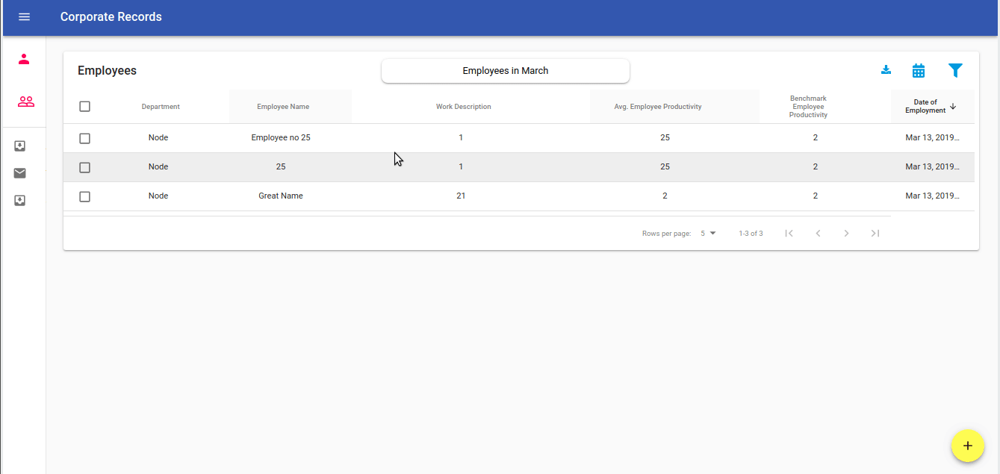

### Live Demo running in [Google Cloud Platform](https://steel-aileron-266311.appspot.com)



### A quite exhaustive React, Node/Express, MongoDB App for rendering tabular data with pagination with full Create, Edit, Delete functionality. Also, have implemented filter functionality for text-based search and date-range based search. Have used Material-UI extensively across the app. Functinality to download the data in `.csv` format.

##### Quite a few standard and simple tests have also been implemented with `jest`

This project was bootstrapped with [Create React App](https://github.com/facebook/create-react-app).

### To launch this project in the local machine.

run `npm install` in both the server directory, which in this project is the root directory (`./`) and also `./client` directories separately, which will install all the npm packages for server and client respectively.

Then, start mongodb service with `sudo service mongod start` and then finally run the following command from inside the `server` directory.

`npm run dev`

This will start both the client (port 3000) and server (port 8080) and launch the site in port 3000.

#### To build the project for production and serve the React static files from `/client/build` (i.e. do these steps before deploying to Google Cloud Platform's Google App Engine)

```
cd client

npm run build

cd ..

```

And check that everything is running properly

```
npm start

```

And then finally deploy to Google Cloud

```
gcloud app deploy --stop-previous-version

```

### Other Commands

#### `npm test`

Launches the test runner in the interactive watch mode.<br>

#### To check the bundle size of overall app and various packages of the Client

``cd client`` and then run

``npm run analyze``